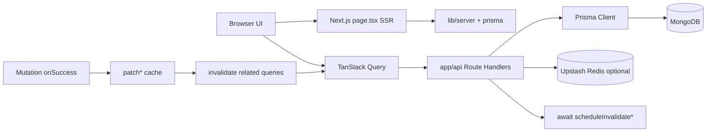

# Stock & Warehouse Inventory Management System — Next.js, TypeScript, Prisma, MongoDB Full-Stack (including AI Business Insights + Admin Panel + Client & Supplier Role-Based Dashboards & more)

[](https://opensource.org/licenses/MIT)
[](https://nextjs.org/)
[](https://react.dev/)
[](https://www.typescriptlang.org/)
[](https://www.prisma.io/)
[](https://www.mongodb.com/)
[](https://tailwindcss.com/)
[](https://tanstack.com/query)
[](https://vitest.dev/)
[](https://diploi.com/launch/arnobt78/Warehouse-Stock-Inventory-Management-System--NextJS-FullStack)

An open-source, role-based warehouse and stock inventory platform. Store owners (admin), suppliers, and clients manage products, multi-warehouse stock, orders, invoices, shipping, payments, support tickets, and analytics — with SSR-first Next.js pages, TanStack Query for instant UI updates after CRUD, and optional Stripe / Shippo / Brevo / Redis / Sentry / AI integrations.

- **Live demo:** [https://stockly-inventory.vercel.app/](https://stockly-inventory.vercel.app/)
- **Security:** Report vulnerabilities privately — see [SECURITY.md](SECURITY.md) (`contact@arnobmahmud.com`).
- **Author:** [Arnob Mahmud](https://www.arnobmahmud.com) · [GitHub @arnobt78](https://github.com/arnobt78)


## Table of Contents

- [Project Overview](#project-overview)
- [Who Is This For?](#who-is-this-for)
- [Features & Functionality](#features--functionality)
- [Technology Stack](#technology-stack)
- [Keywords & Concepts (Learner Glossary)](#keywords--concepts-learner-glossary)
- [Libraries & Dependencies (What / Why / How)](#libraries--dependencies-what--why--how)
- [Architecture: How Data Flows](#architecture-how-data-flows)
- [Getting Started](#getting-started)
- [Demo Accounts & Seed Scripts](#demo-accounts--seed-scripts)
- [Environment Variables](#environment-variables)
- [Project Structure](#project-structure)
- [Application Routes](#application-routes)
- [API Endpoints](#api-endpoints)
- [Backend & Database](#backend--database)
- [Key Components & Reuse](#key-components--reuse)
- [Testing & Quality Gates](#testing--quality-gates)
- [Walkthrough: Run and Learn](#walkthrough-run-and-learn)
- [Deploying](#deploying)
- [Security](#security)
- [Conclusion](#conclusion)
- [Keywords](#keywords)
- [License](#license)

---

## Project Overview

Stockly is a **full-stack inventory, order, and warehouse management system**. One codebase serves three roles with different dashboards and permissions:

| Role                    | Typical home        | What they do                                                                                   |
| ----------------------- | ------------------- | ---------------------------------------------------------------------------------------------- |
| **Admin** (store owner) | `/` or `/admin/...` | Full catalog, warehouses, orders, invoices, users, analytics, client/supplier portal overviews |
| **Supplier**            | `/supplier`         | Own catalog slice, related orders/invoices (read where gated), tickets, revenue KPIs           |
| **Client**              | `/client`           | Browse products by owner, place orders, pay invoices (Stripe), support tickets                 |

**Core idea for learners:**  
Pages are **SSR-first** (`force-dynamic` + server prefetch in `page.tsx`). The browser then hydrates with **TanStack Query**. After any create/update/delete, mutations **patch the cache** (instant badges/rows) then **invalidate** related queries so lists, detail pages, and portals stay in sync — including after the browser **Back** button — without a full page refresh. Optional **Upstash Redis** caches API/SSR payloads; writes **await** Redis invalidation before the HTTP response so clients never refetch stale server cache.

You do **not** need every third-party key to learn or run the app. With only MongoDB + JWT + public API URL, you get auth, catalog, orders, invoices, warehouses, and tickets. Stripe, Shippo, Brevo, ImageKit, Redis, Sentry, and AI are **optional upgrades**.

---

## Who Is This For?

- **Beginners** learning Next.js App Router, Prisma, and typed APIs
- **Intermediate** developers studying role-based access, SSR + client cache sync, and payment/shipping webhooks
- **Teams** who want a reference architecture for inventory SaaS-style features
- **Recruiters / reviewers** evaluating a production-shaped portfolio project

---

## Features & Functionality

### Catalog & stock

- **Products** — CRUD, SKU, category/supplier, price, quantity, reserved/committed stock, QR codes, ImageKit images (optional), CSV/Excel import & export, soft vs hard delete by order history
- **Categories & suppliers** — CRUD, active/inactive, detail pages with product grids and recent orders
- **Warehouses** — Types (e.g. main/overflow), allocations per product, allocate/edit/delete rows, inter-warehouse **transfers**, order-line warehouse picking with “max available at warehouse” validation

### Commerce

- **Orders** — Line items, tax/shipping/discount, status pipeline, payment status (unpaid / partial / paid / refunded), Self vs Client buyer display, cancel vs process refund
- **Invoices** — One-to-one with order; draft → sent → paid/overdue/cancelled; PDF; email send; partial Stripe checkout
- **Payments** — Stripe Checkout + webhook; confirm-session on return; incremental partial pay
- **Shipping** — Shippo rates/labels/tracking; test-key friendly silent US to-address + USPS preference when using `shippo_test_*`

### Collaboration & ops

- **Support tickets** — Create/reply/reassign; optional related product; role-scoped lists
- **Product reviews** — Eligibility from purchases; admin approve/reject
- **Notifications** — In-app bell; optional Brevo email + QStash queue
- **Audit / import history** — Admin activity and product import logs
- **Analytics** — Dashboard KPIs, business insights charts, forecasting, optional AI insights (OpenRouter → Groq fallback)
- **API docs & status** — In-app OpenAPI-oriented docs and health probes

### UX polish (worth studying)

- Shell-first loading (titles/filters stay; data pulses)
- Glass UI tokens, semantic date colors, copyable IDs, dense catalog cells
- Instant list/detail badges after order/invoice/ship mutations
- Role-scoped warm prefetch of nav routes

---

## Technology Stack

| Layer           | Choice                                                                         | Role in this project                           |
| --------------- | ------------------------------------------------------------------------------ | ---------------------------------------------- |
| Framework       | **Next.js 16** App Router                                                      | Pages, layouts, Route Handlers (`app/api`)     |
| UI              | **React 19**, **Tailwind 3.4**, **shadcn/ui** (Radix)                          | Components, dialogs, tables                    |
| Language        | **TypeScript 5**                                                               | End-to-end types (`types/`, Zod, Prisma)       |
| Database        | **MongoDB** + **Prisma 6**                                                     | Document models, repositories in `prisma/*.ts` |
| Auth            | **JWT** cookie (`session_id`), **bcryptjs**, optional Google OAuth             | Session in `utils/auth.ts`                     |
| Server state    | **TanStack Query 5**                                                           | Lists/details, patch → invalidate              |
| Forms           | **React Hook Form** + **Zod**                                                  | Dialogs and API `safeParse`                    |
| Tables / charts | **TanStack Table**, **Recharts**                                               | Data grids and insights                        |
| Tests           | **Vitest 4**                                                                   | Unit + invalidation audit (~200+ checks)       |
| Optional        | Stripe, Shippo, Brevo, ImageKit, Upstash Redis/QStash, Sentry, OpenRouter/Groq | Payments, ship, email, cache, monitor, AI      |

There is **no Python** in this repository — scripts use **TypeScript** via `tsx`.

---

## Keywords & Concepts (Learner Glossary)

| Keyword                | Meaning here                                                                                    |
| ---------------------- | ----------------------------------------------------------------------------------------------- |
| **SSR-first**          | Server component in `page.tsx` loads session + data; client component receives `initial*` props |
| **force-dynamic**      | Disables static caching of the route so each request can use fresh session/data                 |
| **TanStack Query**     | Client cache for API data; keys live in `lib/react-query/config.ts`                             |
| **Invalidation**       | After mutation, mark related queries stale so they refetch; often after an optimistic **patch** |
| **Patch → invalidate** | Update cached rows immediately, then refetch for truth                                          |
| **Redis cache**        | Optional server cache; `scheduleInvalidate*Caches` must finish before API 200                   |
| **JWT session**        | Signed token in HTTP-only-style cookie flow; verified per API request                           |
| **RBAC**               | Role-based access control — admin / supplier / client gates in API + UI                         |
| **Stock allocation**   | Product qty split across warehouses; reserved for open orders                                   |
| **committedQuantity**  | Display helper for qty reserved by orders/allocations                                           |
| **Soft delete**        | Product hidden (`deletedAt`) when order history exists but no active order                      |
| **Webhook**            | Stripe/Shippo/QStash POST to your `/api/...` with signature verification                        |
| **Zod**                | Runtime schema validation for forms and API bodies                                              |
| **shadcn/ui**          | Copy-paste Radix + Tailwind components under `components/ui/`                                   |

---

## Libraries & Dependencies (What / Why / How)

### Next.js + React

**What:** React framework with file-based routing and API routes.  
**Why:** One repo for UI + backend; SSR for SEO/auth/data.  
**How:** `app/products/page.tsx` (server) → `components/Pages/ProductsPage.tsx` (client).

```tsx
// Pattern (simplified): server page prefetch → client list
export const dynamic = "force-dynamic";

export default async function ProductsRoute() {
  const session = await getSession();
  const initialProducts = await getProductsForPage(session);
  return <ProductsPage initialProducts={initialProducts} />;
}
```

### Prisma + MongoDB

**What:** ORM that generates a typed client from `schema.prisma`.  
**Why:** Safer queries than raw drivers; shared models.  
**How:** `npx prisma generate` (also `postinstall`); `npx prisma db push` after schema changes on MongoDB.

```ts
import { prisma } from "@/prisma/client";
const products = await prisma.product.findMany({ where: { deletedAt: null } });
```

### TanStack Query

**What:** Async state manager for server data.  
**Why:** Loading/error/cache, shared across pages, Back-button friendly.  
**How:** Hooks in `hooks/queries/*`; mutations call `invalidateAllRelatedQueries` / order-graph helpers.

```tsx
import { useProducts } from "@/hooks/queries";

const { data, isLoading } = useProducts();
```

### Zod + React Hook Form

**What:** Schema validation + form state.  
**Why:** Same rules on client and API (`safeParse` + `logger.warn` on 4xx).  
**How:** See `lib/validations/product.ts` and product/order dialogs.

### Axios

**What:** HTTP client wrapper (`utils/axiosInstance`).  
**Why:** Consistent base URL (`NEXT_PUBLIC_API_URL`) and cookie credentials for `/api/*`.

### Stripe / Shippo / Brevo (optional)

| Lib      | Package                             | Enables                              |
| -------- | ----------------------------------- | ------------------------------------ |
| Stripe   | `stripe`, `@stripe/stripe-js`       | Checkout, webhook, refunds           |
| Shippo   | `shippo`                            | Labels, rates, tracking              |
| Brevo    | REST via `lib/email`                | Invoice email, reminders             |
| ImageKit | `@imagekit/nodejs`                  | Product image CDN                    |
| Upstash  | `@upstash/redis`, `@upstash/qstash` | Cache + email queue                  |
| Sentry   | `@sentry/nextjs`                    | Errors via `/api/monitoring` tunnel  |
| AI       | OpenRouter + Groq helpers           | Business insights / forecasting text |

---

## Architecture: How Data Flows



1. **First paint:** Server fetches with session → `initialData` → hooks seed cache (`withInitialData` / `useSyncSsrQueryData`).
2. **CRUD:** API writes DB → awaits Redis pattern clear → returns JSON → client patches visible rows → invalidates lists/portals/dashboard.
3. **Back nav:** `useBackWithRefresh` invalidates domain keys before `router.back()` so the previous list is fresh.

---

## Getting Started

### Prerequisites

- **Node.js** 20+ recommended (18+ may work)
- **npm**
- **MongoDB** local or [Atlas](https://www.mongodb.com/atlas)

### Install & run

```bash
git clone https://github.com/arnobt78/Warehouse-Stock-Inventory-Management-System--NextJS-FullStack.git
cd Warehouse-Stock-Inventory-Management-System--NextJS-FullStack

npm install

cp .env.example .env
# Edit .env — set at least DATABASE_URL, JWT_SECRET, NEXT_PUBLIC_API_URL

npx prisma generate   # also runs on postinstall
npx prisma db push    # sync schema to MongoDB (first time)

npm run dev           # http://localhost:3000 (Turbopack)
```

| Script           | Command                   | Purpose                          |
| ---------------- | ------------------------- | -------------------------------- |
| Dev              | `npm run dev`             | Local server (Turbopack)         |
| Build            | `npm run build`           | `prisma generate` + `next build` |
| Start            | `npm run start`           | Production server                |
| Lint             | `npm run lint`            | ESLint                           |
| Test             | `npm run test`            | Vitest suite                     |
| Invalidate audit | `npm run test:invalidate` | TanStack/API write coverage      |

**Important:** You **do** need a `.env` with the **three required** variables to run. Optional vars are not required for core learning — leave them commented in `.env.example`.

---

## Demo Accounts & Seed Scripts

After DB is empty or reset, seed demo users:

```bash
npm run script:reset-demo-db              # accounts (+ Test Supplier entity)
npm run script:seed-demo-catalog          # small explore catalog (optional)
# or: npx tsx scripts/reset-demo-db.ts --with-catalog
```

| Role     | Email               | Password   |
| -------- | ------------------- | ---------- |
| Admin    | `test@admin.com`    | `12345678` |
| Client   | `test@client.com`   | `12345678` |
| Supplier | `test@supplier.com` | `12345678` |

On `/login`, the role Select can pre-fill these demo credentials for faster QA.

---

## Environment Variables

Validated in `lib/env.ts`. Copy `.env.example` → `.env`. **Never commit `.env`.**

### Required (app will not start without these)

| Variable              | Description                                     | Local example                                                    |
| --------------------- | ----------------------------------------------- | ---------------------------------------------------------------- |
| `DATABASE_URL`        | MongoDB connection string                       | `mongodb://localhost:27017/stockly` or Atlas `mongodb+srv://...` |
| `JWT_SECRET`          | Signs session JWTs                              | Long random string (32+ chars in production)                     |
| `NEXT_PUBLIC_API_URL` | Public base URL (emails, client API, redirects) | `http://localhost:3000`                                          |

### Minimal `.env`

```env
DATABASE_URL="mongodb://localhost:27017/stockly"
JWT_SECRET="your-super-secret-jwt-key-min-32-chars"
NEXT_PUBLIC_API_URL="http://localhost:3000"
```

### Optional (enable features when set)

| Group            | Variables                                                                            | Where to get them                                                                                                            |
| ---------------- | ------------------------------------------------------------------------------------ | ---------------------------------------------------------------------------------------------------------------------------- |
| **ImageKit**     | `IMAGEKIT_*`, `NEXT_PUBLIC_IMAGEKIT_*`                                               | [imagekit.io](https://imagekit.io)                                                                                           |
| **Google OAuth** | `GOOGLE_CLIENT_ID`, `GOOGLE_CLIENT_SECRET`, `NEXT_PUBLIC_GOOGLE_CLIENT_ID`           | [Google Cloud Console](https://console.cloud.google.com/apis/credentials) — redirect URI → `/api/auth/oauth/google/callback` |
| **Brevo**        | `BREVO_API_KEY`, `BREVO_SENDER_*`, `BREVO_ADMIN_EMAIL`                               | [brevo.com](https://www.brevo.com)                                                                                           |
| **Sentry**       | `SENTRY_DSN`, `NEXT_PUBLIC_SENTRY_DSN` (+ optional org/project/auth for source maps) | [sentry.io](https://sentry.io) — browser uses tunnel `/api/monitoring`                                                       |
| **Redis**        | `UPSTASH_REDIS_URL` + `TOKEN` (or REST pair)                                         | [upstash.com](https://upstash.com)                                                                                           |
| **QStash**       | `QSTASH_URL`, `QSTASH_TOKEN`, signing keys                                           | Upstash QStash — webhook `/api/email/queue/process`                                                                          |
| **AI**           | `OPENROUTER_API_KEY`, optional `GROQ_API_KEY` / `GROQ_MODEL`                         | [openrouter.ai](https://openrouter.ai), [console.groq.com](https://console.groq.com)                                         |
| **Stripe**       | `STRIPE_API_KEY`, `STRIPE_WEBHOOK_SECRET`, `NEXT_PUBLIC_STRIPE_PUBLISHABLE_KEY`      | [dashboard.stripe.com](https://dashboard.stripe.com) — webhook → `/api/payments/webhook`                                     |
| **Shippo**       | `SHIPPO_API_KEY`, optional `SHIPPO_FROM_*`                                           | [goshippo.com](https://goshippo.com) — use `shippo_test_*` for free-tier label tests                                         |
| **Misc**         | `NEXT_PUBLIC_APP_URL`, `INTERNAL_API_KEY`, `NEXT_PUBLIC_DISABLE_BROWSER_TRANSLATE`   | App metadata; cron Bearer for reminders; optional `translate="no"` in prod                                                   |

### How to achieve each required variable

1. **`DATABASE_URL`**
   - Local: install MongoDB → create DB name `stockly` → use `mongodb://localhost:27017/stockly`.
   - Atlas: Create free cluster → Database Access + Network Access → Connect → Drivers → copy URI → replace password and DB name.

2. **`JWT_SECRET`**
   - Generate: `openssl rand -base64 48` (or any long random string).
   - Use a **different** value in production than local.

3. **`NEXT_PUBLIC_API_URL`**
   - Local: `http://localhost:3000`.
   - Production: your Vercel URL (e.g. `https://stockly-inventory.vercel.app`) — must match the public origin so cookies/emails/redirects work.
   - Note: `NEXT_PUBLIC_*` is baked into the **client** bundle; redeploy after changing it.

### Full template

The repo ships a commented template — prefer copying the file rather than pasting from memory:

```bash
cp .env.example .env
```

See [`.env.example`](.env.example) for every optional key with comments.

### Browser translation note

Chrome “Translate this page” can trigger React `removeChild` noise. Prefer testing without translate. Sentry scrubbing drops known translate/Radix portal races. Optional: `NEXT_PUBLIC_DISABLE_BROWSER_TRANSLATE=true` in production only.

---

## Project Structure

```bash
stock-inventory/
├── app/                      # Next.js App Router (pages + api)
│   ├── layout.tsx            # Root layout, providers, force-dynamic
│   ├── page.tsx              # Admin home / store overview
│   ├── login/ · register/
│   ├── products/ · orders/ · invoices/
│   ├── categories/ · suppliers/ · warehouses/
│   ├── client/ · supplier/   # Role portals
│   ├── support-tickets/ · business-insights/
│   ├── api-docs/ · api-status/
│   ├── settings/ · admin/    # Admin nested routes
│   └── api/                  # Route Handlers (REST JSON)
├── components/
│   ├── ui/                   # shadcn primitives
│   ├── Pages/                # Page shells (client)
│   ├── products/ · orders/ · invoices/ · warehouses/ …
│   ├── auth/ · layouts/ · shared/ · providers/
│   └── admin/                # Admin embeds
├── hooks/queries/            # TanStack hooks + mutations
├── contexts/                 # Auth context
├── lib/
│   ├── api/ · auth/ · cache/ · server/ · react-query/
│   ├── validations/ · stripe/ · shippo/ · email/ · ai/
│   ├── products/ · orders/ · stock-allocation/ · monitoring/
│   └── env.ts                # Required/optional env validation
├── prisma/                   # schema.prisma + repository helpers
├── types/                    # Shared TS interfaces
├── utils/                    # auth JWT helpers, axios
├── scripts/                  # Demo reset/seed (tsx)
├── docs/                     # Deep-dive guides for agents/devs
├── middleware.ts
├── SECURITY.md
└── .env.example
```

---

## Application Routes

| Path                                                  | Roles         | Description                                                         |
| ----------------------------------------------------- | ------------- | ------------------------------------------------------------------- |
| `/`                                                   | Admin         | Store overview KPIs                                                 |
| `/login`, `/register`                                 | Public        | Auth (+ Google if configured)                                       |
| `/products`, `/products/[id]`                         | Role-scoped   | Catalog list & detail                                               |
| `/orders`, `/orders/[id]`                             | Role-scoped   | Orders                                                              |
| `/invoices`, `/invoices/[id]`                         | Role-scoped   | Invoices (supplier often read-only)                                 |
| `/categories`, `/suppliers`, `/warehouses` (+ `[id]`) | Role-scoped   | Catalog entities                                                    |
| `/client`                                             | Client        | Client portal                                                       |
| `/supplier`                                           | Supplier      | Supplier portal                                                     |
| `/support-tickets`                                    | All logged-in | Tickets                                                             |
| `/business-insights`                                  | Admin         | Charts / AI                                                         |
| `/api-docs`, `/api-status`                            | Logged-in     | Docs & probes                                                       |
| `/settings/email-preferences`                         | Logged-in     | Email prefs                                                         |
| `/admin/*`                                            | Admin         | Dashboard, CRUD mirrors, users, reviews, history, portals, settings |

---

## API Endpoints

Base: `/api/*`. Most routes require a valid session cookie. Webhooks use provider signatures instead.

### Auth

| Method | Path                              | Notes          |
| ------ | --------------------------------- | -------------- |
| POST   | `/api/auth/register`              | Create user    |
| POST   | `/api/auth/login`                 | Set session    |
| POST   | `/api/auth/logout`                | Clear session  |
| GET    | `/api/auth/session`               | Current user   |
| GET    | `/api/auth/oauth/google`          | Start OAuth    |
| GET    | `/api/auth/oauth/google/callback` | OAuth callback |

### Products, Categories, Suppliers, Warehouses, Stock Allocations, Stock Transfers

| Method                 | Path                                                                   |
| ---------------------- | ---------------------------------------------------------------------- |
| GET, POST, PUT, DELETE | `/api/products` (+ `/api/products/[id]` GET/…)                         |
| POST                   | `/api/products/image`, `/api/products/import`, `/api/products/qr-code` |
| GET, POST, PUT, DELETE | `/api/categories`, `/api/categories/[id]`                              |
| GET, POST, PUT, DELETE | `/api/suppliers`, `/api/suppliers/[id]`                                |
| GET, POST, PUT, DELETE | `/api/warehouses`, `/api/warehouses/[id]`                              |
| GET, POST, PUT, DELETE | `/api/stock-allocations`, `/api/stock-allocations/[id]`                |
| POST                   | `/api/stock-transfers`                                                 |

### Orders, Invoices

| Method           | Path                                                 |
| ---------------- | ---------------------------------------------------- |
| GET, POST        | `/api/orders`                                        |
| GET, PUT, DELETE | `/api/orders/[id]`                                   |
| GET, POST        | `/api/invoices`                                      |
| GET, PUT, DELETE | `/api/invoices/[id]`                                 |
| GET              | `/api/invoices/[id]/pdf`                             |
| POST             | `/api/invoices/[id]/send`, `/api/invoices/reminders` |

### Payments, Shipping, Webhooks

| Method   | Path                                                                               |
| -------- | ---------------------------------------------------------------------------------- |
| POST     | `/api/payments/checkout`, `/api/payments/confirm-session`, `/api/payments/webhook` |
| POST/GET | `/api/shipping/labels`, `/api/shipping/rates`, `/api/shipping/tracking`            |
| POST     | `/api/shipping/webhook`                                                            |

### Portals, Dashboards

| Method | Path                                                                                 |
| ------ | ------------------------------------------------------------------------------------ |
| GET    | `/api/dashboard`, `/api/admin/counts`                                                |
| GET    | `/api/portal/client`, `/api/portal/client/catalog`, `browse-meta`, `browse-products` |
| GET    | `/api/portal/supplier`                                                               |
| GET    | `/api/client-portal`, `/api/supplier-portal` (admin overviews)                       |
| GET    | `/api/admin/client-orders`, `/api/admin/client-invoices`                             |

### Support, Reviews, Users, System

| Method    | Path                                                                         |
| --------- | ---------------------------------------------------------------------------- |
| CRUD-ish  | `/api/support-tickets`, replies, `owner-products`, `product-owners`          |
| CRUD-ish  | `/api/product-reviews`, eligibility, by-product                              |
| Admin     | `/api/users`, `/api/audit-logs`, `/api/system-config`, `/api/import-history` |
| GET/PUT   | `/api/user/email-preferences`                                                |
| GET/PATCH | `/api/notifications/in-app` (+ unread-count, mark-all-read)                  |
| GET/POST  | `/api/forecasting`, `/api/ai/insights`                                       |
| GET       | `/api/health`, `/api/openapi`, `/api/performance`, `/api/system-metrics`     |
| POST      | `/api/email/queue/process` (QStash webhook)                                  |

In-app browsing: `/api-docs`. Machine-readable: `GET /api/openapi`.

---

## Backend & Database

### Models (high level)

Defined in `prisma/schema.prisma`: **User**, **Category**, **Supplier**, **Product**, **Warehouse**, **StockAllocation**, **StockTransfer**, **Order**, **OrderItem**, **Invoice**, **SupportTicket**, **ProductReview**, **Notification**, **ImportHistory**, audit-related collections, etc.

### Layers

| Layer          | Location                                        | Job                                        |
| -------------- | ----------------------------------------------- | ------------------------------------------ |
| HTTP           | `app/api/**/route.ts`                           | Auth, Zod `safeParse`, status codes        |
| Domain helpers | `prisma/*.ts`, `lib/products/*`, `lib/orders/*` | Business rules (delete policy, stock sync) |
| SSR loaders    | `lib/server/*-data.ts`                          | Page prefetch + Redis keys                 |
| Cache          | `lib/cache/post-mutation.ts`                    | Awaited invalidation patterns              |
| Responses      | `lib/api/response-helpers.ts`                   | JSON helpers; 5xx → Sentry                 |

### Auth sketch

```ts
// utils/auth.ts — verify cookie JWT, load user
const session = await getSessionFromRequest(request);
if (!session) return unauthorizedResponse();
if (session.role !== "admin") return forbiddenResponse();
```

### Product delete policy (example of domain rules)

- Active order (not delivered/cancelled) → **409**
- History only → **soft delete** (`deletedAt`)
- No orders → **hard delete** (+ ImageKit cleanup when configured)

---

## Key Components & Reuse

### UI primitives

```tsx
import { Button } from "@/components/ui/button";
import { Dialog, DialogContent } from "@/components/ui/dialog";

<Button variant="default">Save</Button>;
```

Copy `components/ui/*`, `lib/utils` (`cn`), and Tailwind/shadcn config into another project to reuse the design system.

### Query hooks

```tsx
import { useOrders, useUpdateOrder } from "@/hooks/queries";

const { data } = useOrders();
const updateOrder = useUpdateOrder();
// onSuccess already patches + invalidateAfterOrderGraphChange
```

When adding a new mutation elsewhere: call `invalidateAllRelatedQueries` (or the domain helper) in `onSuccess`; for deletes use `cancelOrRemoveDetailQuery` first.

### Auth context

```tsx
import { useAuth } from "@/contexts";

const { user, isLoggedIn, logout } = useAuth();
```

### Shared list/detail building blocks

| Component                       | Reuse idea                              |
| ------------------------------- | --------------------------------------- |
| `StatisticsCard`                | KPI cards with optional badge pulse     |
| `PageSectionHeader`             | Consistent page titles                  |
| `PaginationSelector`            | Rows-per-page (Radix-safe)              |
| `DeferredSelectGate`            | Avoid Select portal races on navigation |
| `SafeImage` / `SafeAvatarImage` | Image fallbacks                         |
| `CopyableText`                  | One-click copy without toast spam       |
| `DialogSubmitButton`            | Pending spinner on forms                |
| `ProductLineItemsList`          | Order/invoice line thumbs               |

### Glass / typography tokens

Prefer importing from `lib/ui/*` (`glass-button-styles`, `typography-scale`, `shell-layout-styles`) instead of one-off class strings — keeps light/dark and density consistent when porting UI.

---

## Testing & Quality Gates

```bash
npm run lint
npm run test
npm run test:invalidate   # mutation → invalidation audit
npm run build
npx tsc --noEmit
```

**Vitest** (not Jest) is the unit runner. Prefer `vitest` APIs and path aliases already configured for this repo. The invalidate suite protects the “CRUD updates everywhere without refresh” guarantee.

---

## Walkthrough: Run and Learn

1. Set the **three** required env vars → `npm install` → `npx prisma db push` → `npm run dev`.
2. `npm run script:reset-demo-db` → login as `test@admin.com` / `12345678`.
3. Create a **category** and **supplier**, then a **product**; open detail — note QR, stock, insights.
4. Create a **warehouse**, **Allocate** stock to the product.
5. Create an **order** with warehouse picks; watch reserved/committed update.
6. Create **invoice** → (optional) Stripe pay → status/payment badges update on lists instantly.
7. Log in as **client** / **supplier** demo users; compare portals.
8. Open Network tab: mutations should not leave related pages stuck on old data after Back.
9. Optionally add Stripe test keys, Shippo test key, or Sentry DSN and repeat payment/ship/error paths.

Agent deep-dive docs: [`docs/PROJECT_WALKTHROUGH.md`](docs/PROJECT_WALKTHROUGH.md), [`docs/MANUAL_TEST_FIXTURES.md`](docs/MANUAL_TEST_FIXTURES.md).

---

## Deploying

Typical target: **Vercel**.

1. Import the GitHub repo.
2. Set env vars (required three + any optionals). Remember `NEXT_PUBLIC_*` need redeploy to change.
3. Build command: `npm run build` (already runs Prisma generate).
4. Point Stripe/Shippo/QStash webhooks at your production URLs.
5. After deploy, confirm Ready on the tip commit; optional Sentry 24h watch.

### Optional: Launch with Diploi

Spin up a cloud environment from this public repo with no local install:

[](https://diploi.com/launch/arnobt78/Warehouse-Stock-Inventory-Management-System--NextJS-FullStack)

Click the button to create a Diploi deployment.  
When it finishes, open the preview URL from the Diploi dashboard.  
More info: [https://diploi.com/](https://diploi.com/)

Diploi is optional for trying the project. Production demos for this repo use Vercel (above).

---

## Security

To report a security vulnerability **privately**, see **[SECURITY.md](SECURITY.md)** and email **<contact@arnobmahmud.com>**.  
Do **not** open public GitHub issues for security bugs. Do not paste secrets or `.env` contents into reports.

---

## Conclusion

Stockly is a teaching-oriented, production-shaped inventory stack: **Next.js 16**, **React 19**, **Prisma/MongoDB**, **JWT roles**, **TanStack Query** (patch → invalidate), optional **Redis**, and real integrations (Stripe, Shippo, Brevo, Sentry, AI). Use this README as a map — start with three env vars, explore demo roles, then peel into `app/api`, `hooks/queries`, and `lib/server` as you learn SSR and cache coherence. Reuse `components/ui`, validation schemas, and invalidation helpers in your own apps.

---

## Keywords

stock inventory, warehouse management, inventory management system, Next.js 16, React 19, TypeScript, Prisma, MongoDB, TanStack Query, Zod, React Hook Form, shadcn/ui, Tailwind CSS, JWT authentication, role-based access control, admin dashboard, client portal, supplier portal, orders, invoices, stock allocation, Stripe, Shippo, Brevo, ImageKit, Upstash Redis, QStash, Sentry, OpenRouter, Groq, Vitest, SSR, App Router, Arnob Mahmud

---

## License

This project is licensed under the [MIT License](https://opensource.org/licenses/MIT). Feel free to use, modify, and distribute the code as per the terms of the license.

---

## Happy Coding! 🎉

This is an **open-source project** — feel free to use, enhance, and extend this project further!

If you have any questions or want to share your work, reach out via GitHub or my portfolio at [https://www.arnobmahmud.com](https://www.arnobmahmud.com).

**Enjoy building and learning!** 🚀
