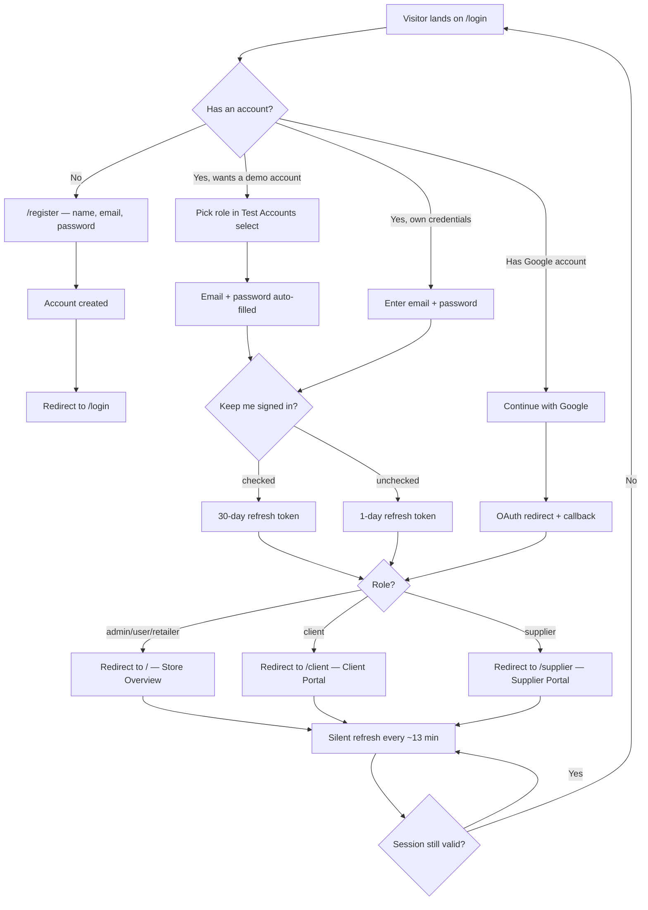
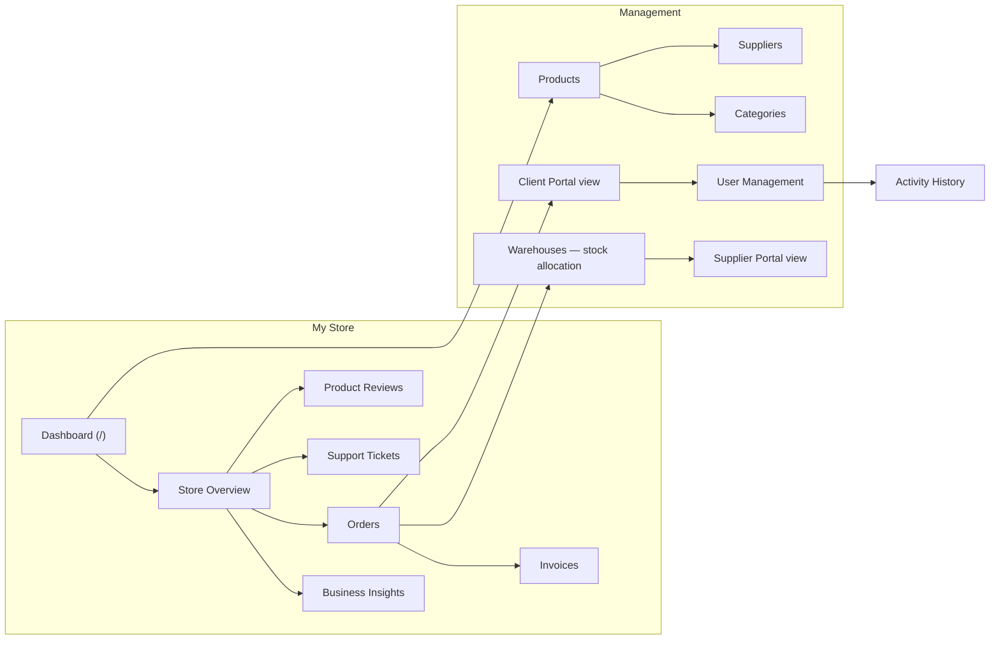
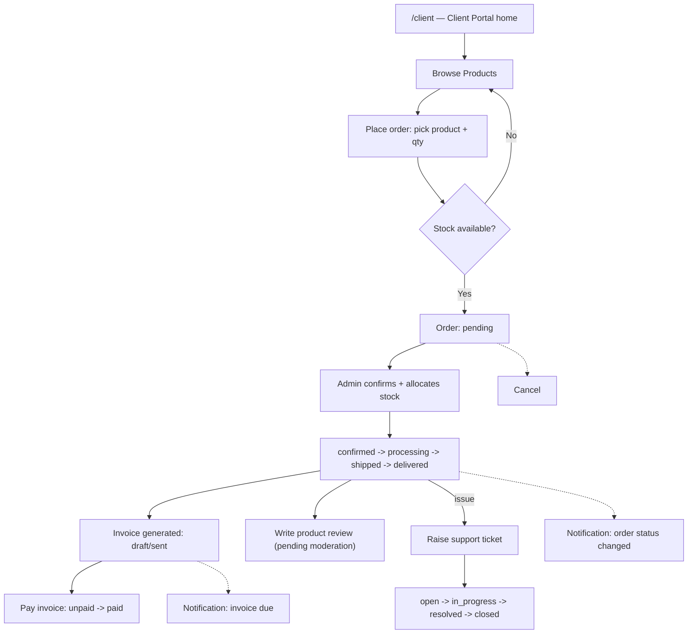
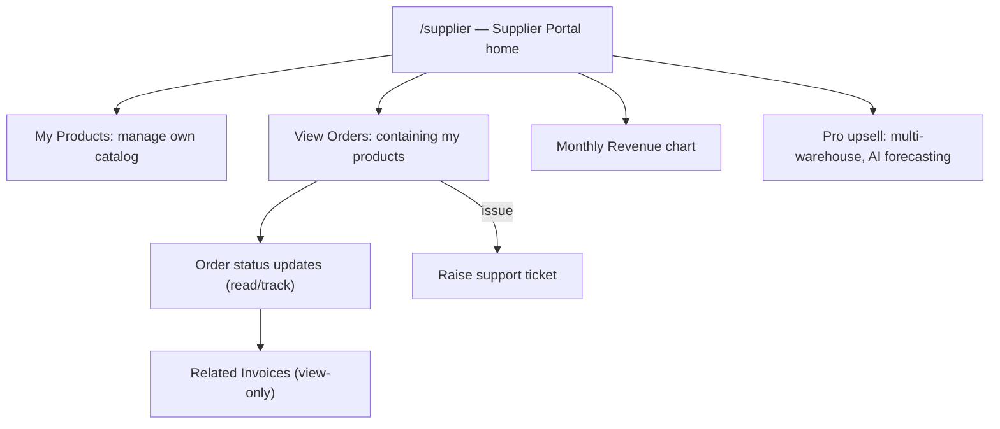
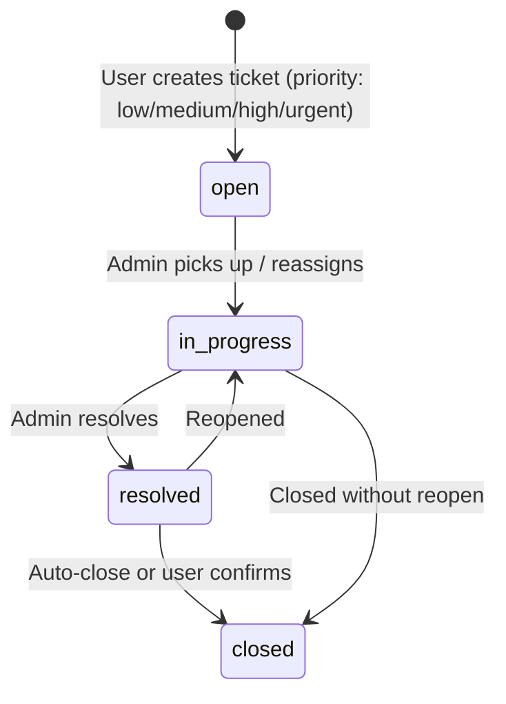
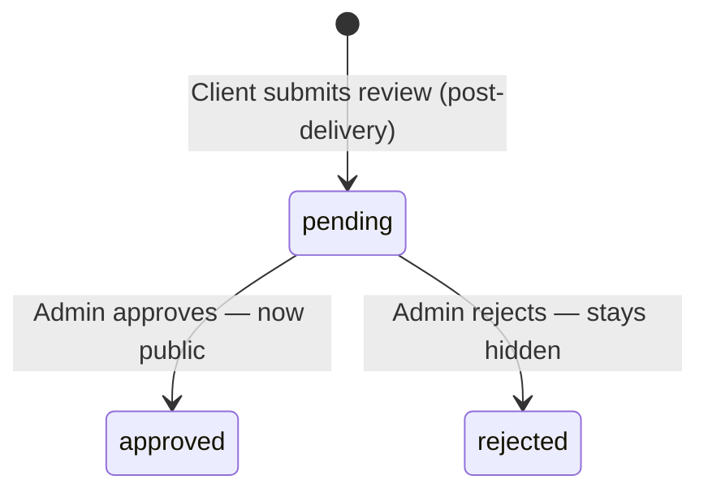
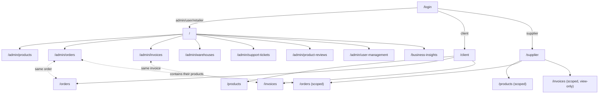

# Octalve IMS — User Flows & User Stories

Product-level documentation: who uses this app, what they do in it, and
how those journeys connect end to end. Grounded in the actual route/nav
config (`lib/navigation/admin-nav-config.ts`, `role-nav-config.ts`), the
actual Order/Invoice/SupportTicket status fields in
`prisma/schema/sales.prisma` and `support.prisma`, and the demo accounts
in `lib/auth/demo-seed-users.ts`. A companion styled page with the same
content lives at `docs/user-flows-and-stories.html`.

For engineering/architecture documentation, see
[`PROJECT_WALKTHROUGH.md`](./PROJECT_WALKTHROUGH.md) and
[`auth-system-port-plan.md`](./auth-system-port-plan.md) — this document
is deliberately product/UX-facing, not implementation-facing.

---

## 1. Personas

| Persona | Role string | Home route | Demo account |
|---|---|---|---|
| **Store Owner (Admin)** | `admin` | `/` | `test@admin.com` |
| **Client** — buys from the store | `client` | `/client` | `test@client.com` |
| **Supplier** — fulfills from their own catalog | `supplier` | `/supplier` | `test@supplier.com` |
| **Retailer** | `retailer` | `/` (no dedicated portal yet) | `test@retailer.com` |

The Retailer role exists in the RBAC permission table
(`lib/auth/can.ts`) and the login role-select for QA purposes, but has
no dedicated nav/portal today — it currently sees the same general
dashboard as Admin, scoped by whatever permissions its role grants. It's
included below as a persona to track, not as a fully fleshed journey.

Every persona starts at the same front door: **Auth**.

---

## 2. Authentication Flow

**Goal:** get a visitor into the workspace that matches their role,
with as little friction as possible for demo/QA use, and real security
(bcrypt, CSRF, rate limiting, rotating refresh tokens) for production use.

1. Visitor lands on `/login`.
2. Optionally picks a **demo role** from the "Test Accounts To Login
   With" select — this pre-fills email + password for one of the 4
   canonical accounts (Admin / Client / Supplier / Retailer).
3. Enters email + password manually, **or** clicks **Continue with
   Google** (OAuth redirect, comes back to `/api/auth/oauth/google`).
4. Optionally checks **"Keep me signed in"** — controls refresh-token
   lifetime (1 day unchecked, 30 days checked).
5. Submits. Server validates credentials, rate-limits by
   `<ip>:<email>`, issues a short-lived access token + rotating refresh
   token as httpOnly cookies.
6. Redirected by role: `client` → `/client`, `supplier` → `/supplier`,
   everyone else → `/`.
7. A "Welcome back" toast fires post-redirect.
8. Session silently refreshes every ~13 minutes while active
   (`hooks/use-auth-refresh.ts`); a hard 401 anywhere bounces back to
   `/login`.
9. **Logout** (sidebar footer, any role): confirmation dialog → server
   clears cookies → redirect to `/login` with a goodbye toast.

No account? **Create account** on `/register` — name, email, password,
optional Google sign-up, defaults to the `user`/`admin`-tier role
Milestone-0 policy currently assigns to self-registrations.

---

## 3. Admin / Store Owner Flows

The Admin sidebar is grouped into **My Store** (day-to-day operations),
**Management** (catalog/people admin), and **My Activity**.

### 3.1 Store Overview (`/`)

The landing dashboard: store-wide stats (products, orders, revenue,
invoices, warehouses, suppliers, categories — including activity from
clients/suppliers, not just the admin's own), a Quick Access grid to
every major section, and inline Products/Suppliers/Categories lists.
"My Activities" (`/admin/my-activity`) is the personal-only equivalent.

### 3.2 Product management (`/admin/products`, `/categories`, `/suppliers`)

1. Admin opens **Products**, sees stock/status/QR per row.
2. **Create** a product — name, SKU, price, category, supplier,
   opening stock, expiry date.
3. **Import** products in bulk (CSV) or **Export** the catalog.
4. Edit or **delete** a product (confirmation dialog).
5. Assign/adjust **Categories** and **Suppliers** the same way (own
   list pages, same CRUD pattern).
6. Low-stock / stock-out products surface as chips on the stat cards
   and drive **Warehouses** stock-allocation decisions.

### 3.3 Orders (`/admin/orders`)

Order lifecycle (`Order.status` in `prisma/schema/sales.prisma`):

`pending → confirmed → processing → shipped → delivered`, with
`cancelled` reachable from any pre-delivered state. Payment is tracked
independently: `unpaid → partial → paid`, or `refunded`.

1. Admin reviews incoming orders (placed by Clients, or created
   on a client's behalf).
2. Confirms → allocates stock across one or more **Warehouses**
   (auto-assign or manual pick, capped at each warehouse's available
   quantity).
3. Advances status as fulfillment progresses; the client sees the same
   status in their portal in real time.
4. Cancels/refunds when needed — reflected in both the order and its
   linked invoice's payment status.

### 3.4 Invoices (`/admin/invoices`)

Invoice lifecycle: `draft → sent → paid`, with `overdue` (past due
date, unpaid) and `cancelled` as terminal/exception states. Invoices
are generated from orders; Admin can resend, mark paid, or cancel.

### 3.5 Warehouses & stock (`/admin/warehouses`)

Admin manages warehouse records and **allocates stock** to orders
across them — either auto-assign (system picks warehouses to cover the
quantity) or a manual pick capped at that warehouse's on-hand quantity.
Transfers between warehouses are also supported.

### 3.6 Support Tickets (`/admin/support-tickets`)

Ticket lifecycle: `open → in_progress → resolved → closed`.
Priority: `low | medium | high | urgent`. Admin triages, reassigns,
and replies via ticket chat; any role can open a ticket from their own
"My Activity"/profile area.

### 3.7 Product Reviews (`/admin/product-reviews`)

Reviews written by Clients go through moderation:
`pending → approved` or `rejected`. Only approved reviews surface on
the client-facing product pages.

### 3.8 People & portals

- **Supplier Portal** (`/admin/supplier-portal`) / **Client Portal**
  (`/admin/client-portal`) — admin's read/manage view into each
  supplier's and client's activity (their own portal pages, from the
  admin's side).
- **User Management** (`/admin/user-management`) — create users, assign
  roles (admin/client/supplier/retailer/user), suspend/delete
  (confirmation dialog).
- **Activity History** (`/admin/activity-history`) — audit trail.
- **Business Insights** (`/business-insights`) — store-wide analytics
  beyond the dashboard's headline numbers.
- **Email Preferences** (`/admin/settings/email-preferences`) — which
  notification emails the admin receives (low stock, order updates,
  etc. — see `types/auth.ts`'s `EmailPreferences`).

---

## 4. Client Flows

Client nav: **Client Portal**, **Browse Products**, **My Orders**,
**My Invoices**.

1. Lands on `/client` — personal snapshot (orders, invoices due,
   recent activity).
2. **Browse Products** (`/products`) — catalog, filter by category/
   supplier, see stock availability.
3. **Place an order** — pick product(s) + quantity; the system checks
   available stock (auto-assign warehouse by default, or the client
   can request a specific warehouse if the admin's flow allows manual
   pick) and blocks over-quantity requests against real availability.
4. **Track the order** (`/orders`) through
   `pending → confirmed → processing → shipped → delivered`, with
   live status as the admin advances it.
5. **Pay an invoice** (`/invoices`) generated from the order —
   `unpaid`/`partial` → `paid`.
6. **Write a product review** once an order is delivered — goes to
   `pending` moderation before it's publicly visible.
7. **Raise a support ticket** if something's wrong with an order,
   product, or invoice — tracked through the same
   `open → in_progress → resolved → closed` lifecycle Admin sees.
8. Receives **notifications** (bell icon) for order status changes,
   invoice due dates, and ticket replies.

---

## 5. Supplier Flows

Supplier nav: **Supplier Portal**, **My Products**, **View Orders**,
**Related Invoices**.

1. Lands on `/supplier` — snapshot scoped to *their own* catalog:
   total products, orders containing their products, pending orders
   awaiting action, and revenue (paid/due/partial/refund breakdown,
   excluding cancelled).
2. **My Products** — manage only the products they supply (create,
   edit, stock levels); catalog and revenue figures on the dashboard
   are derived from this set.
3. **View Orders** — any order containing at least one of their
   products, with the same status pipeline as Admin/Client see, but
   scoped and typically read-mostly (fulfillment actions stay with
   Admin unless the product's tier grants suppliers direct action).
4. **Related Invoices** — view-only detail on invoices tied to their
   orders (same `/invoices/[id]` route Admin/Client use).
5. Sees a **Monthly Revenue** trend chart (last 6 months) and a
   **Pro-tier upsell** card (multi-warehouse allocation, AI demand
   forecasting, stock reviews) — visible on Core, inert until upgraded.
6. Same **support ticket** and **notification** access as every role.

---

## 6. Cross-Cutting Flows

These aren't role-specific — every persona touches them the same way.

### 6.1 Support ticket lifecycle

### 6.2 Product review moderation

### 6.3 Notifications

Bell icon in the topbar, every role. Sources: order status changes,
invoice due/overdue, ticket replies, low-stock alerts (admin/supplier).
Each is delete-able individually with the same confirmation-dialog
pattern used for logout and other destructive actions.

---

## 7. Role & Navigation Map

---

## 8. User Stories

Format: **As a** `<persona>`, **I want to** `<action>`, **so that**
`<benefit>`. Grouped by feature area; `P0` = core/day-one,
`P1` = important, `P2` = nice-to-have.

### Authentication

| # | Priority | Story |
|---|---|---|
| US-01 | P0 | As a **visitor**, I want to sign in with email/password, so that I can access my workspace. |
| US-02 | P0 | As a **visitor**, I want to sign in with Google, so that I don't need a separate password. |
| US-03 | P1 | As a **returning user**, I want a "Keep me signed in" option, so that I'm not forced to re-login every day on my own device. |
| US-04 | P2 | As a **QA tester**, I want a role-based demo-account select on login, so that I can exercise every persona without memorizing credentials. |
| US-05 | P0 | As a **any logged-in user**, I want a confirmation prompt before logging out, so that I don't lose my session by an accidental click. |
| US-06 | P1 | As a **new user**, I want to self-register an account, so that I can start using the store without waiting on an admin invite. |

### Store Owner (Admin) — Catalog & Operations

| # | Priority | Story |
|---|---|---|
| US-07 | P0 | As a **Store Owner**, I want a single dashboard with store-wide totals (products, orders, revenue, invoices), so that I can gauge business health at a glance. |
| US-08 | P0 | As a **Store Owner**, I want to create/edit/delete products with category, supplier, price, and stock, so that my catalog stays accurate. |
| US-09 | P1 | As a **Store Owner**, I want to bulk-import/export products via CSV, so that I can onboard or migrate a large catalog quickly. |
| US-10 | P0 | As a **Store Owner**, I want to see low-stock and stock-out counts on the dashboard, so that I can reorder before I run out. |
| US-11 | P0 | As a **Store Owner**, I want to review and confirm incoming orders, so that fulfillment only starts on orders I've vetted. |
| US-12 | P0 | As a **Store Owner**, I want to allocate order stock across specific warehouses (auto or manual), so that fulfillment reflects real warehouse availability. |
| US-13 | P0 | As a **Store Owner**, I want to advance an order through pending → confirmed → processing → shipped → delivered, so that the client always sees accurate status. |
| US-14 | P1 | As a **Store Owner**, I want to cancel or refund an order, so that I can handle exceptions without leaving the order in a false "delivered" state. |
| US-15 | P0 | As a **Store Owner**, I want invoices generated from orders and trackable through draft/sent/paid/overdue, so that I know what revenue is outstanding. |
| US-16 | P1 | As a **Store Owner**, I want to manage warehouses and transfer stock between them, so that I can rebalance inventory as demand shifts. |
| US-17 | P0 | As a **Store Owner**, I want a searchable, badge-counted sidebar (orders/invoices/tickets/reviews needing attention), so that I never lose track of what's pending. |

### Store Owner (Admin) — People & Moderation

| # | Priority | Story |
|---|---|---|
| US-18 | P0 | As a **Store Owner**, I want to create users and assign roles (admin/client/supplier/retailer), so that I control who can do what. |
| US-19 | P1 | As a **Store Owner**, I want to suspend or delete a user account (with confirmation), so that I can revoke access without accidental data loss. |
| US-20 | P1 | As a **Store Owner**, I want a read view into each client's and supplier's own portal activity, so that I can support them without asking them to screen-share. |
| US-21 | P0 | As a **Store Owner**, I want to triage, reassign, and reply to support tickets by priority, so that urgent issues get handled first. |
| US-22 | P1 | As a **Store Owner**, I want to approve or reject client-submitted product reviews before they go public, so that spam or abusive reviews never reach the storefront. |
| US-23 | P2 | As a **Store Owner**, I want an activity-history audit trail, so that I can answer "who changed this and when." |
| US-24 | P1 | As a **Store Owner**, I want business-insights analytics beyond the headline dashboard numbers, so that I can spot trends, not just totals. |
| US-25 | P2 | As a **Store Owner**, I want to control which notification emails I personally receive, so that I'm not flooded with alerts I don't need. |

### Client

| # | Priority | Story |
|---|---|---|
| US-26 | P0 | As a **Client**, I want to browse the product catalog with category/supplier filters, so that I can find what I need quickly. |
| US-27 | P0 | As a **Client**, I want to place an order and have it blocked if stock isn't actually available, so that I never order something I can't receive. |
| US-28 | P0 | As a **Client**, I want to track my order's status in real time, so that I know when to expect delivery without contacting support. |
| US-29 | P0 | As a **Client**, I want to view and pay my invoices, so that I can settle what I owe without a manual back-and-forth. |
| US-30 | P1 | As a **Client**, I want to write a review after my order is delivered, so that I can share feedback on the product. |
| US-31 | P1 | As a **Client**, I want to raise a support ticket tied to my order/invoice, so that I have a documented, trackable way to resolve issues. |
| US-32 | P1 | As a **Client**, I want notifications when my order status or invoice due date changes, so that I don't have to keep checking manually. |

### Supplier

| # | Priority | Story |
|---|---|---|
| US-33 | P0 | As a **Supplier**, I want a dashboard scoped to only my own products/orders/revenue, so that I never see or worry about other suppliers' data. |
| US-34 | P0 | As a **Supplier**, I want to manage only the products I supply, so that I control my own catalog without touching the wider store. |
| US-35 | P0 | As a **Supplier**, I want to see every order that contains at least one of my products, so that I know what I need to fulfill. |
| US-36 | P1 | As a **Supplier**, I want view-only access to invoices tied to my orders, so that I can confirm what the client was billed without editing rights I shouldn't have. |
| US-37 | P1 | As a **Supplier**, I want a revenue trend chart (paid/due/partial/refunded, excluding cancelled), so that I can track my own earnings over time. |
| US-38 | P2 | As a **Supplier**, I want to see what Pro-tier features unlock (multi-warehouse allocation, AI forecasting), so that I can decide if upgrading is worth it. |

### Cross-cutting

| # | Priority | Story |
|---|---|---|
| US-39 | P0 | As **any user**, I want a confirmation dialog before any destructive action (delete, logout), so that I can't lose data with one misclick. |
| US-40 | P1 | As **any user**, I want to dismiss a confirmation dialog by clicking outside it, so that backing out doesn't require hunting for a Cancel button. |
| US-41 | P1 | As **any user**, I want individually dismissible notifications, so that I can clear what I've already seen without losing what's new. |
| US-42 | P2 | As **any user**, I want light/dark mode, so that the app is comfortable in my environment. |
| US-43 | P1 | As **any user**, I want a working global search in the topbar, so that I can jump to any page without hunting through the sidebar. |

---

*Last updated alongside the Suite Portal design reskin and the
"Keep me signed in" login feature (2026-09-03).*
